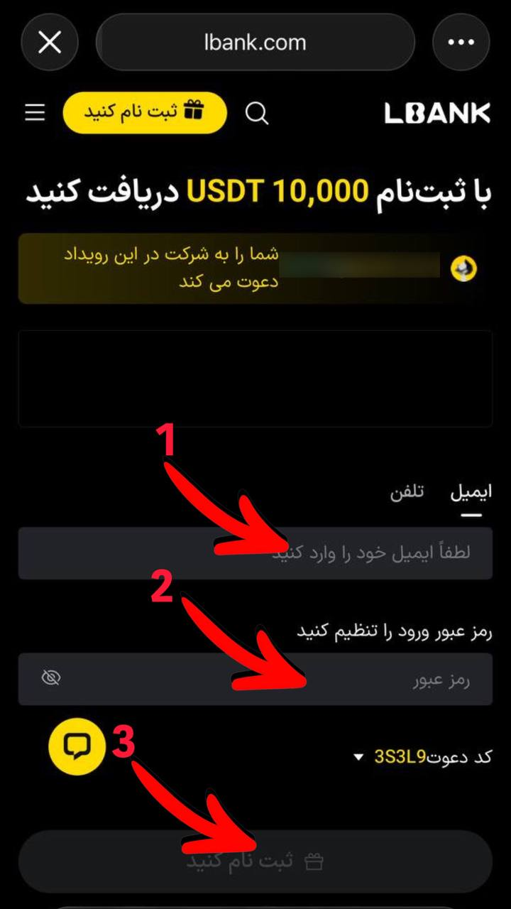

# Lbank_exhange
آموزش ثبت‌نام در صرافی البانک

# آموزش ثبت‌نام در صرافی Lbank

---

## مرحله اول: ورود به سایت و وارد کردن اطلاعات

برای شروع، روی لینک یا دکمه ثبت‌نام در ربات کلیک کنید. سپس ایمیل خود را در کادر مشخص شده وارد نمایید. در کادر دوم یک رمز برای حساب خود مشخص کنید و سپس روی ثبت نام کلیک کنید.



---

## مرحله دوم: تایید ایمیل

به صندوق ایمیل خود بروید و کدی که برایتان ارسال شده را پیدا کنید. آن کد را در کادر مربوطه در صرافی وارد کنید.

---

## مرحله سوم: نمایش UID حساب کاربری

مطابق تصویر، وارد بخش پروفایل شوید.


---

## مرحله نهایی: کپی کردن UID حساب کاربری

با کلیک روی علامت مشخص شده در تصویر، UID حساب خود را کپی کرده و در ربات (بخش ارسال UID) ارسال کنید.


---
```

---
